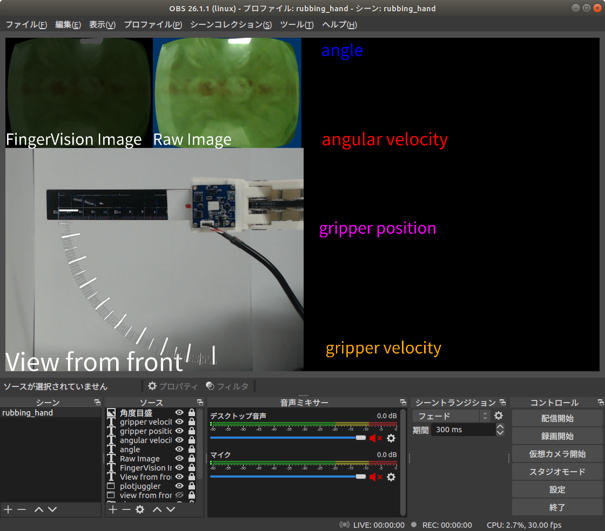

# 研究ノート

# How to use rubbing_hand

- FingerVision起動  
  1.  mjpgstreamer起動
      ~~~sh
      $ ./mjpg_streamer -i "./input_uvc.so -f -1 -r 320x240 -d /dev/video4 -n" -o "./output_http.so -w ./www -p 8080"
      ~~~
      ダイレクトリンク    
      http://localhost:8080/?action=stream&dummy=file.mjpg

      - カメラのデバイス番号取得  
        ~~~sh
        $ v4l2-ctl --list-devices
        ~~~
      
      - シェルスクリプト  
        ~~~sh
        $ bash mjpgstreamer.sh [camera device num e.g.4 default=2]
        ~~~
        homeとかrubbing_hand/scriptsとかに置いてある  
        雑に絶対パスで書いてるのでどこから実行しても大丈夫だぁ


  2.  FingerVisionのローンチファイル実行  
      ~~~sh
      $ roslaunch rubbing_hand fv_1_filtered.launch 
      ~~~

  3.  ~~フィルターノード起動~~ (2のローンチファイルに組み込み)
      ~~~sh
      $ rosrun rubbing_hand filter_node.py
      ~~~

- ロボットハンド起動
    1.  コントローラBluetooth接続
        ~~~sh
        $ bluetoothctl
        [bluetooth]# power on
        [bluetooth]# connect B8:78:26:F7:86:9A
        [Joy-Con (L)]# exit
        ~~~

        - bluetoothがpower onにならないとき  
          1. まずsoftwareスイッチの状態を確認  
              ```sh
              $ sudo rfkill list all
              0: hci0: Bluetooth
                Soft blocked: yes
                Hard blocked: no
              1: phy0: Wireless LAN
                Soft blocked: no
                Hard blocked: no
              ```
              `Soft blocked`が`yes`の場合は、ソフトウェアの設定でBluetoothがOFFになっています。そして、GUIから操作してもどうしてもONに戻らない。
          2. 強制的にすべてのブロックを解除
              ```sh
              $ sudo rfkill unblock all
              ```
          3. (option?)Bluetoothを再起動
              ```sh
              $ sudo systemctl restart bluetooth.service
              ```


    2.  ダイナミクセルノード起動  
        おまじない  
        USBのlatencyをいい感じに直す？  
        dynamixelとの通信が爆速になる
        ```sh
        $ bash rubbing_hand/scripts/fix_usb_latency.sh [ttyUSBX]
        ```
        ノード起動
        ~~~sh
        $ rosrun rubbing_hand dynamixel_thick_node.py 
        ~~~
        USBと電源挿してるか確認

-   トピック確認    
    ~~~sh
    $ rosrun plotjuggler plotjuggler
    ~~~

- 複数USBカメラを使う時のおまじない
  ~~~sh
  $ sudo rmmod uvcvideo
  $ sudo modprobe uvcvideo quirks=128
  ~~~
  
# データ採集
- rosbag   
  Sample 
  ~~~sh
  $ rosbag record -a -o CAVS00
  ~~~
  Ctrl+Cで記録終了

  - rosbag record -a  
    すべてのtopicを取得します。後々に欲しいROSトピックが記録漏れをしていると悲しいので、基本的にこれを使えば良いと思います。ただ画像のROSトピックは情報量が膨大になてしまいます。
  - rosbag record /topic1 /topic2  
    名前を指定して特定のROSトピックを取得できます。
  - rosbag record -o [pre file name]  
    [pre file name]_YYYY-MM-DD-hh-mm-ss.bagに保存
  - rosbag record -O [file name]  
    [file name].bagに保存

# データプロット
## rosbag -> csv,png,eps
**rosbag_to_csv_multi.py**  
rosbagを読み取り，['time', 'angle', "angular velocity", "gripper position", "gripper velocity", "process"]をcsvへ保存  
4つのグラフの画像も作ってくれる．

## csv -> error_csv,png
**csv_to_error.py**  
rosbag_to_csv_multi.pyで作成したcsvを使ってerror計算  
~~目標角速度超過量の2乗和を出す~~  
色々評価指標を計算  
グラフもつくる

## error_csv -> png
**csv_to_graph4.py**  
csv_to_error.pyで作成したerror記載のcsvを使ってグラフ作成

## csv -> png
**csv_to_timeseriesgraph.py**
rosbag_to_csv_multi.pyで作成したcsvを使って，angle/angular velocity/gripper positionのグラフ作成

# 録画
OBSstudioを使う  
FingerVisionの処理後・処理前ウィンドウと，正面から撮影しているUSBカメラのキャプチャと，（plotjugglerのウィンドウ）をひとまとめにして録画  



**注意**  
現状，plotjugglerを起動しながらOBSstudioで録画を行うとPCがクソ重くなって遅延が発生するので，録画を行うときはplotjugglerは起動しないこと  

- 設定ファイル  
  - プロファイル  
    ~/ドキュメント/obs_studio/profile_4rubbing_hand  
    各種設定が保存されている  
  - シーンコレクション  
    ~/ドキュメント/obs_studio/scene_collection_4rubbing_hand.json  
    ソースが保存されている  
- 設定変更  
  設定を開いて,,,  
  - 保存フォルダの変更  
    出力→録画→録画ファイルのパス  
  - 保存ファイル名の変更  
    詳細設定→録画→ファイル名書式設定  
    CAVS%CCYY-%MM-%DD or FLAT%CCYY-%MM-%DD として，接頭語をつけている．  
    ファイルが重複すると末尾に(1),(2),..がつくため，これをIDとみなして管理  
- 録画開始/終了  
  録画開始/終了ボタンを押せばいい  
  ホットキー未設定  

<br >

# 以下テンプレ

# hot key in EXTENSIONS
## Insert Date String
**日付を挿入する**  
[ctr]+[Shift]+[i]  
YYYY-MM-DD hh:mm:ssの形  
例 2021-05-10 17:16:20

## Markdown All in One
**各種ショートカット**
キー            |   コマンド
---             |   ---
Ctrl + B        |   太字
Ctrl + I        |   イタリック体
Alt + S         |   取り消し
Ctrl + Shift + ]|   ヘッディングレベル上げ
Ctrl + Shift + [|   ヘッディングレベル下げ
Ctrl + M        |   数学記述（4343とか書ける）
Alt + C         |   タスクリストのチェック・チェック解除
Ctrl + Shift + V|   プレビュー切り替え
Ctrl + K V      |   プレビューを横に表示

## Paste Image
**画像を挿入する**  
クリップボードに画像が保存されている状態で，  
`ctrl+alt+V`  or `ctrl+shit+P(コントロールパレット)→Paste Image`  
貼り付けられるmdファイルと同じ階層のimage4mdディレクトリ内に画像が保存され，下の文字列が挿入される  
``

# 数式テスト
* $a_i=a_{i-1}+a_{i-2}$
* a_i=a_{i-1}+a_{i-2}
* $\sum{a_i}=\Pi{b_i}$
* $\arcsin\$
  
# サンドボックス
## 見出し2
### 見出し3

***太字斜字***  
**太字**  
*斜字*  
~~削除します~~

***
線を引く

---

* 箇条書き1
* 箇条書き2
  * 箇条書き3
  * 箇条書き4
    * 箇条書き5
    * 箇条書き6
* 箇条書き7
    * 箇条書き8

1. 数字付き1
1. 数字付き2
1. 数字付き3

|header  |boldになる  |↓アラインメント行  |
|---|:-:|--:|
|左寄せだあああああ |センタリング  |右寄せじゃあああああ  |
|↓空行
|
|い  |ろ  |は  |範囲外  |

|`code`    |*italic*                  |
|----------|--------------------------|
|**bold**  |***bold italic***         |
|$ \omega $|[Qiita](http://qiita.com)||

> 引用
>> 二重引用
>
> 二重引用あとは一つ行空けた方が良いみたい
>


ソースコードも書ける。実行はできない。

【Python】
```python
# コメント
import numpy
import pandas

print('Hello World')
```
【C言語】
```c
// コメント
#include<stdio.h>

int main(){
    printf("Hello World")
}
```

【C++】
```c++
// コメント
#include <iostream>
using namespace std;

int main(void){
    cout << "Hello World" << endl
}
```
CとC++は同じ色付けだね。（そりゃそーか）

---

改行するときはスペース2つ入れる↓

【拡張機能：HTMLやPDFに変換】  
http://www.atmarkit.co.jp/ait/articles/1804/27/news034.html

[リンク⇒拡張機能：HTMLやPDFに変換](http://www.atmarkit.co.jp/ait/articles/1804/27/news034.html)****